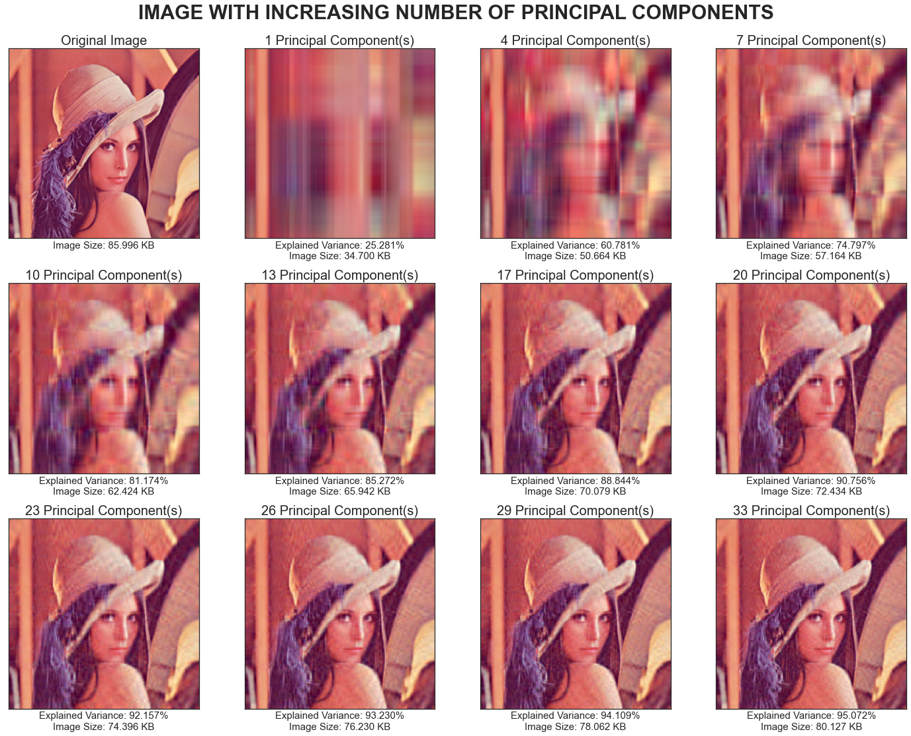

# Image-Compression-with-ML-Techniques
Image compression refer to reducing the dimensions, pixels, or color components of an image so as to reduce the cost of storing or performing operations on them. Some image compression techniques also identify the most significant components of an image and discard the rest, resulting in data compression as well.  
Image compression can therefore be defined as a data compression approach that reduces the data bits needed to encode an image while preserving image details.

## Need of image compression techniques
1. Data takes up lesser storage when compressed. As a result, this allows more data to be stored with less disk space. This is especially useful in healthcare, where medical images need to be archived, and dataset volume is massive.
2. Some image compression techniques involving extracting the most useful components of the image (PCA), which can be used for feature summarization or extraction and data analysis.
3. Federal government or security agencies need to maintain records of people in a pre-determined, standard, and uniform manners. Thus, images from all sources need to be compressed to be of one uniform shape, size, and resolution.

## Types of Image Compression
There are two types of image compressions:
1. **Loseless Compression** &#8594; It is a type of data compression wherein any sort of data loss is avoided leading to larger compressed images. Original images can be reconstructed from loseless compression.
2. **Lossy Compression** &#8594; It is the type of compression wherein useful data is retained and additional bits are discarded. This leads to smaller sized compressed images. However, it is not possible to reconstruct original images from the compressed images.

## Project Description
This project explores three Machine Learning Techniques to compress images. These are as follows:
1. Image Compression Using Principal Component Analysis [Notebook](https://github.com/AbhinavS99/Image-Compression-with-ML-Techniques/blob/main/Image_Compression_PCA.ipynb).
2. Image Compression Using K-Means Clustering [Notebook](https://github.com/AbhinavS99/Image-Compression-with-ML-Techniques/blob/main/Image_Compression_KMeans.ipynb).

---

## Outline
1. [Image Compression Using PCA](#image-compression-using-pca)
2. [Image Compression Using KMeans](#image-compression-using-kmeans)

---

## Image Compression Using PCA
### Image Exploration
Each pixel in an image can be represented as three 8-bit unsigned (positive) integers ranging from 0 to 255, or scaled into three unsigned (positive) float ranging from 0 to 1. The three values specify the intensity values of each red, green, blue color, which often called as RGB encoding. In this notebook, we use a 220 by 220 pixels of lena.png, which serve as a standard test image widely used in image processing field.

Lena Image|
:---------:|
|

Pixels are stored as a 3D matrix with shape (220, 220, 3). The first two values specify the width and height of the image, the last value specifies the RGB encoding.  
The original image size of lena.png is 86 KB and has 37270 unique colors present in the image.

### Principal Component Analysis
Principal Component Analysis or PCA is an unsupervised learning technique that is used majorly for dimensionality reduction. The process by which PCA reduces the dimensions via the following process :-
1. It computes eigenvectors from the covariance matrix labelled as principal axes.
2. These are sorted decreasingly by the eigenvalues called percentage of explained variance.
3. The next step is to center the dataset and project it to the principal axes and leading to the formation of principal components.
4. For dimensionality reduction, only a certain components are considered.
5. PCA involves Singular Value Decomposition. Basically for PCA, we initially normalize the dataset and then Singular Value Decomposition.

### Process of Dimensionality Reduction
1. Assume Dataset to be 'X'
2. Normalize the dataset and center it at origin
3. The above steps cover the normalization part. The next step is to go for Singular Value Decomposition.
4. The SVD will then calculate k eigenvectors for each feature and yield a matrix V with the shape n(number of features) x k
5. The PCA projection will be Z = XV where X is the normalized and centered version of the original dataset.
6. For dimensionality reduction we take up n' < n features.

### Applying PCA for Image Compression
1. A RGB image can be considered as 3 2-D matrices overlapping each other where each matrix represents the red, green and the blue component of the image.
2. Each matrix can be considered as a dataset with the number of rows represent the number of samples and the number of columns represent the number of the features.
3. PCA can be then applied individually to each channel.

Images of each color channel|
:---------:|
|

Principal Components of Each Color Channel|
:---------:|
|

Explained Variance v/s Number of Components|
:---------:|
|

### Generating Results
For generation of results and progessively showing the compressed images following steps are undertaken:
1. For all the number of principal components i.e. from 1 to 220 we perfrom the below written operations
2. Subset the first n columns for PCA projections and n rows of the components
3. Combine the PCA Reconstruction for all the color channels.
4. Generate the metric viz. Explained Variance, Image Size, No. Of Colors
5. Plot the compressed images with an increasing number of principal components.

Metrics by Number of Principal Components|
:---------:|
|

Image with increasing number of principal components|
:----:|
|

Comparision with the Original Image|
:----:|
|

|Parameter| Value|
|-----|---|
|Reduction in Size|6.285%|
|Explained Variance|95.072%|

## Image Compression Using KMeans
### Image Exploration 
Same as in the PCA section

### KMeans Clustering
K-Means Algorithm is an unsupervised learning algorithm which is employed in partioning a dataset into k cluster wherein k is specified by the user. The aim of the algorithm is to divide the dataset into k cluster where each cluster is a group of similar samples. The algorithm tries best to achieve the following conditions:
1. All the samples inside the same cluster should have high similarity.
2. All the samples within different clusters should have high degree of dissimilarity.

Each cluster is represented by a centroid and k-clusters have k centroids.

#### Working of K-Means Algorithm
Following are the steps that take place in the K-Means Algorithm:

1. User specifies the number of clusters/centroids or k.
2. k different points are selected initially and the selection is totally random.
3. Each of the datapoint on the graph is then assigned to their nearest centroid point.
4. The centroids are then updated by computing the mean of the datapoints in that cluster
5. The above steps i.e. assigning datapoints and updating centroid positions are repeated till convergence i.e. when centroids do not update anymore.

### Implementation of K-Means for Image Compression
1. The original image comprises of thousands of colors. The project moves to use K-Means Algorithm to reduce the number of the colors. This will ensure that only few RGB values would be stored and eventually making compressing the image.
2. Each pixel value would be a dataframe with the color channels viz. Red, Green, Blue being the features.
3. For the lena image there will be 220x220 = 48400 samples with 3 features per sample.

Visualizing the pixel in first row of the image in a 3-D plot with the color channel values as the axes|
:-----:|
|

#### Baseline Model
In the baseline model K-Means algorithm would be applied with k = 2. The aim of the baseline model is just to visualize the process.  
K-Means Algorithm gave us 2 centroids. The next step is to replace the pixels in a cluster with their respective centroid values. In this scenario since the clusters are 2, therefore the output image will only have 2 colors only.

Reconstructed Image Using Baseline Model|
:-----:|
|

#### Evaluation Metrics
1. **Within Cluster Sum of Squares(WCSS)** &#8594; This measures the sum of squared Euclidean distance of all the points within a cluster to its cluster centroid.
2. **Between Cluster Sum of Square(BCSS)** &#8594; This measures the sum of squared Euclidean distance between all centroids.
3. **Explained Variance** &#8594; This measures how many percents that the compressed image can explain the variance of the original image.
4. **Image Size** &#8594; Image size, measured in kilobytes to evaluate the reduction/compression performance.

Evaluation Metric Values for Baseline Image

|Metrics|Value|
|----|----|
|WCSS|109260691.31418832|
|BCSS|193071692.34763247|
|Explained Variance|63.861%|
|Image Size| 4.384 KB|

### Generating results with K-Means Algorithm
To generate results(compressed images) following steps will be taken :

1. Range the value of k(number of centroids) from 2 to 20
2. Perform K-Means clustering for all the centroid values.
3. Replace the pixels with the centroids
4. Calculate and store the evaluation parameters.
5. Plot the corresponding compressed/reconstructed image.

Metrics by Number of Principal Components|
:---------:|
|

Image with increasing number of principal components|
:----:|
|

Comparision with the Original Image|
:----:|
|

|Parameter| Value|
|-----|---|
|Reduction in Size|79.115%|
|Explained Variance|95.916%|

